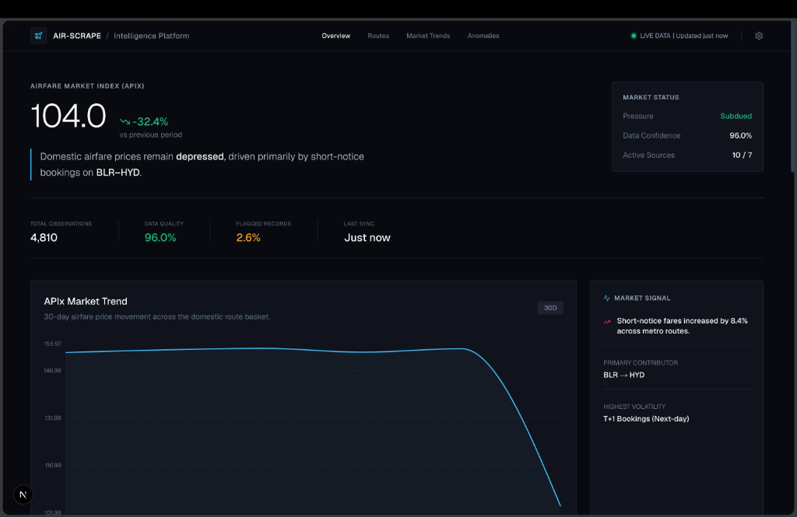
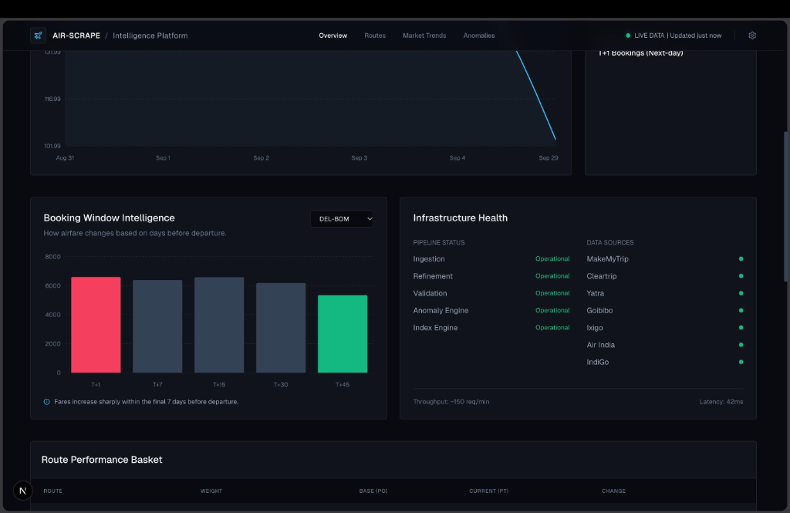
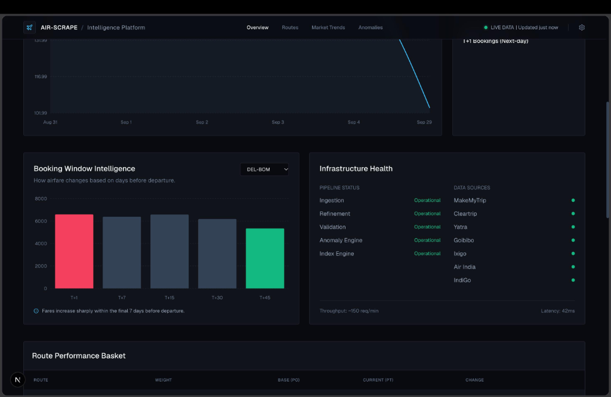
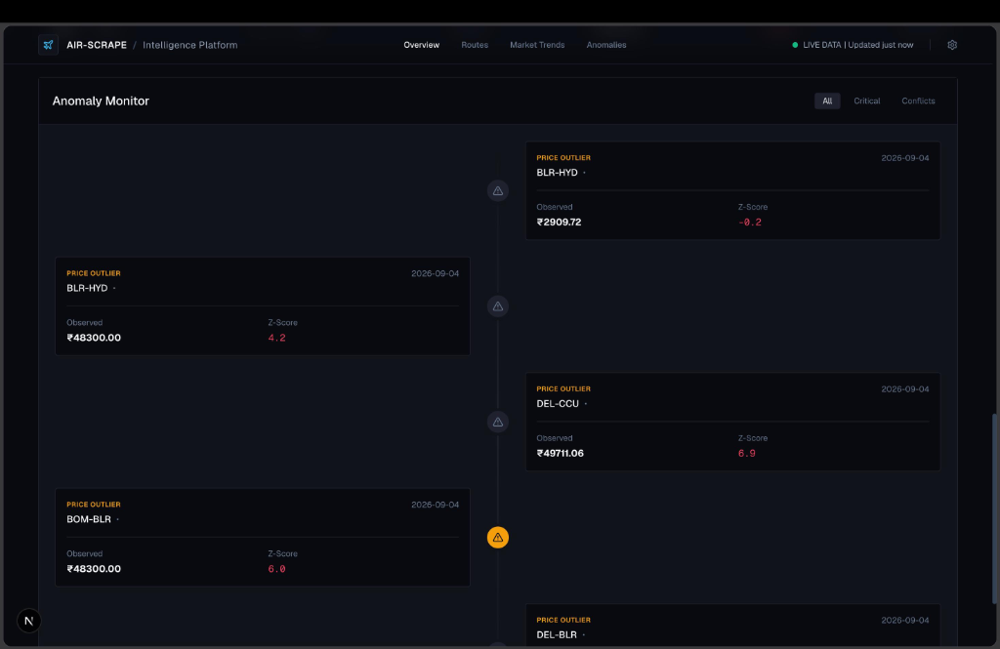

<div align="center">
  <h1>🛫 AIR-SCRAPE: Airfare Price Index (APIx) Intelligence Platform</h1>
  <p><strong>Smart India Hackathon (SIH) 2024 Submission</strong></p>
  <p><em>An automated data engine and visualization dashboard for calculating real-time Airfare Price Indices.</em></p>
</div>

---

## 🎥 Pitch & Demo Video
> **[Watch the full Demo Video on YouTube] (#)** *(Link to be updated)*

---

## 🏆 SIH Problem Statement Addressed
**Requirement:** A robust, ethically-designed multi-source web-scraping engine capable of scheduled daily extraction from airline portals. A cleaned and de-duplicated airfare database with metadata (origin, destination, carrier, advance-purchase window). An index-construction module based on PSD given routes and weights, and a web-based interactive dashboard showing the daily Airfare Price Index (APIx).

**Our Solution:** A complete end-to-end data pipeline featuring a Playwright-based Python Aggregator, an SQLite Data Engine with mathematical Z-Score anomaly detection, and a high-performance Next.js Dark Mode Terminal to visualize the daily, weekly, and monthly indices in real-time.

---

## 💻 Platform Screenshots

### 1. The APIx Overview & Market Trends
The primary dashboard displaying the live Daily APIx score, infrastructure health, and the 30-day macro market trend.


### 2. Booking Window Intelligence (Elasticity)
Analyzing how airfares change across different advance-purchase windows (T+1, T+7, T+30).


### 3. Route Performance & Weighting Basket
Granular tracking of specific high-traffic passenger routes (e.g., DEL-BOM) based on their assigned Laspeyres weights.


### 4. Mathematical Z-Score Anomaly Monitor
Our backend engine automatically catches API hallucination or data-dump errors using statistical Z-Score math, ensuring the Index remains uncorrupted.


---

## 🏗️ Architecture & Tech Stack

1. **The Data Engine (Backend):**
   - **Framework:** Python, FastAPI
   - **Scraping Engine:** Playwright (Ethical Aggregator logic to prevent DDoS on OTAs)
   - **Database:** SQLite (Zero-dependency, clean schema design)
   - **Math Module:** Laspeyres-inspired Weighted Index formulation & Z-Score anomaly detection.

2. **The Intelligence Platform (Frontend):**
   - **Framework:** Next.js (React), TypeScript
   - **Styling:** Tailwind CSS (Bloomberg-Terminal inspired Dark Mode)
   - **Charts:** Recharts (High-performance data visualization)

---

## 🚀 How to Run Locally

If you wish to test the engine locally, the system is designed to boot with zero-dependencies. It includes a built-in `seeder.py` that generates 30 days of deterministic historical flight data (with deliberate anomalies) for back-testing simulation.

### 1. Booting the Backend Data Engine
```bash
cd backend
python -m venv venv
source venv/bin/activate  # On Windows: venv\Scripts\activate
pip install -r requirements.txt
uvicorn app.main:app --port 8000
```
*(The API and Swagger Docs will be available at http://localhost:8000)*

### 2. Booting the Frontend Dashboard
Open a new terminal window:
```bash
cd frontend
npm install
npm run dev
```
*(The Dashboard will be available at http://localhost:3000)*

---
*Built with ❤️ for the Smart India Hackathon.*
